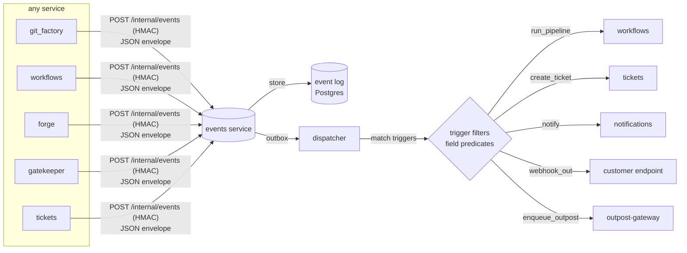

# Events Service — Design

Status: **proposal** · Owner: platform · Supersedes: the git-shaped bits of `hooks`

## 1. Summary

Introduce a first-class **events** service: a single place every codearmory service
emits **JSON events** to, that stores them, and fans them out to **triggers** whose
**field-based filters** decide which **actions** fire (run a pipeline, open a ticket,
notify, call a webhook, enqueue an outpost command).

Today `hooks` already does a narrow version of this — it ingests internal events at
`/internal/events`, stores `HookEvent` rows, and matches git-shaped rules
(`source` + `events` + `ref_filter`) to trigger a workflow. This design **generalizes**
that: any service, any event type, and customer-authored filters over arbitrary event
fields instead of a hard-coded `ref_filter`.

## 2. Goals / non-goals

**Goals**
- One JSON **event envelope** and one SDK emit helper used by every service.
- Reliable, at-least-once emission (outbox), idempotent consumption.
- **Triggers filtered on event fields** — declarative, per-tenant, editable via API /
  Terraform / portal, so customers customize what reacts to what.
- Pluggable **actions**, reusing workflows pipelines as the heavy executor.
- Multi-tenant isolation by `org` / `actor`.

**Non-goals**
- A general streaming/analytics bus (Kafka). We use Postgres + an outbox, matching the
  existing `outpost-gateway` backbone. Analytics can consume later.
- Exactly-once. We do at-least-once + idempotency keys.
- Replacing the outpost cluster-event plane; events may *bridge* to/from it, not absorb it.

## 3. What already exists (reuse, don't reinvent)

- **hooks** — event intake (`/internal/events`, HMAC), storage (`HookEvent`), a rule
  engine (`matchesRefFilter` et al.), and pipeline triggering. Becomes the git-webhook
  *adapter* + is folded into (or demoted below) the events service — see §11.
- **outpost-gateway** — a proven **Postgres outbox → dispatcher → consumer** with
  dead-letter retry and shared-key HMAC. The events service copies this shape.
- **workflows** — pipelines already perform any action as steps (`tickets/create`,
  `forge/run`, `notifications/*`, `outpost-gateway/enqueueCommand`). So "run a pipeline"
  is already a universal action; events just needs to fire it with the event as input.
- **SDK** — services already call `registry.StartKeyRotation(...)` on startup; `EmitEvent`
  is the same idiom (shared HMAC key, conductor-independent internal call).

## 4. Architecture



The events service owns **intake + log + dispatch + trigger matching**. Action execution
is delegated (a pipeline run, a ticket create, an outbound webhook). External git hosts
(GitHub/Gitea) still land through adapter endpoints that normalize into the same envelope.

## 5. Event envelope (the JSON contract)

Every event is one JSON object. This is the stable contract; `type` is the versioned API.

```json
{
  "id": "01J9Z...",                     // ULID, unique — the idempotency key
  "spec_version": "1",                  // envelope version
  "type": "repo.push",                  // dotted, service-namespaced, stable
  "source": "git_factory",              // emitting service
  "subject": "jhparker7/codearmory_git_factory",  // the RESOURCE the event is about
  "actor": { "org_id": "…", "user_id": "…" },     // tenant scope (either may be empty)
  "occurred_at": "2026-07-26T18:20:05Z",
  "trace_id": "…",                      // W3C traceparent for correlation
  "data": {                              // type-specific payload (free-form JSON)
    "ref": "dev",
    "commit": "9af3…",
    "pusher": "jhparker7",
    "clone_url": "http://…/codearmory_git_factory.git"
  }
}
```

Rules:
- **`subject` is mandatory and specific** (a repo, a run, a ticket id). This is what fixes
  today's bug where every git_factory repo shares `source="codearmory_git_factory"` and is
  therefore indistinguishable — triggers filter on `subject`, so per-repo reactions work.
- `type` is a stable, namespaced string (`repo.push`, `pipeline.failed`,
  `forge.execution.completed`, `ticket.created`, `org.member.added`). Adding fields to
  `data` is backward-compatible; renaming a `type` is a breaking change → new `type`.
- `data` is arbitrary JSON — filters reach into it by path (§7).

## 6. Emission

- SDK helper: `events.Emit(ctx, envelope)` — POSTs to `EVENTS_URL/internal/events` with
  `X-Events-Token` (HMAC-SHA256 over `id:type:source:subject:org:user:ts`) using the shared
  `EVENTS_TRIGGER_KEY`, mirroring the current hooks/outpost HMAC scheme.
- **Reliable emit via the transactional outbox**: the producer writes the event to its own
  `outbox` table in the same DB transaction as the state change, and a background flusher
  ships it to events and marks it sent. This guarantees "state changed ⇒ event emitted"
  without 2-phase commit. (Same pattern outpost-gateway already uses.) A best-effort direct
  POST is acceptable for non-critical events to avoid the outbox table.
- Emission never blocks the request path (fire-and-forget goroutine or outbox flusher).

## 7. Triggers — field-based filtering (the customization surface)

A **trigger** = a **filter** over the event JSON + one or more **actions**, scoped to a
tenant. Filters are the customization primitive the plan calls for.

### 7.1 Filter model (declarative, primary form)

A trigger holds a list of **conditions**; each condition is `{ field, op, value }` where
`field` is a dot-path into the envelope (including `data.*`). Conditions combine with
`all` (AND) by default; `any` (OR) groups are allowed for branching.

```json
{
  "name": "git_factory dev builds",
  "match": {
    "all": [
      { "field": "type",        "op": "eq",     "value": "repo.push" },
      { "field": "subject",     "op": "prefix", "value": "jhparker7/codearmory_git_factory" },
      { "field": "data.ref",    "op": "glob",   "value": "dev" }
    ]
  },
  "actions": [ { "kind": "run_pipeline", "pipeline_id": "…", "inputs": {
      "HOOK_REF":    "{{ data.ref }}",
      "HOOK_COMMIT": "{{ data.commit }}",
      "HOOK_REPO":   "{{ subject }}"
  } } ]
}
```

**Operators**: `eq`, `ne`, `in`, `not_in`, `exists`, `prefix`, `suffix`, `glob`, `regex`,
`gt|gte|lt|lte` (numeric), `contains` (array/substring). A missing field is treated as
"not present" (so `exists:false` matches, comparisons fail closed).

**Templating**: action inputs (and webhook bodies) interpolate `{{ path }}` from the event,
so a trigger passes the ref/commit/subject through without bespoke mapping code. This
replaces the current `input_mapping`.

### 7.2 Expression escape hatch

For logic the condition list can't express, a trigger may instead carry
`match.expr`: a **CEL** expression evaluated against the envelope
(`type == "pipeline.failed" && data.attempt >= 3 && actor.org_id == "…"`). CEL is the
k8s-idiomatic, sandboxable choice. The declarative form compiles to CEL internally, so
there is one evaluator.

### 7.3 Why field-filters (vs today's `ref_filter`)

`ref_filter` is one hard-coded field match. Generalizing to `{field, op, value}` lets a
customer trigger on *anything*: a label in `data`, a failure count, a subject prefix, an
actor — without new code per use case. `ref_filter` becomes sugar for
`{field:"data.ref", op:"glob"}`.

## 8. Actions

| kind | does | executor |
|---|---|---|
| `run_pipeline` | start a workflow run with templated inputs | workflows |
| `create_ticket` / `comment` / `update_ticket` | lightweight ticket ops without a whole pipeline | tickets |
| `notify` | send a notification | notifications |
| `webhook_out` | POST the (templated) event to a customer URL, signed | events itself |
| `enqueue_outpost_command` | drive a cluster op (deploy, chaos) | outpost-gateway |

Pipelines remain the heavy executor for anything multi-step; the built-in lightweight
actions exist so trivial reactions (open a ticket on `pipeline.failed`) don't need one.
Every action dispatch is itself recorded and can **emit a result event** (`action.succeeded`
/ `action.failed`) — enabling chains, with guards (§10).

## 9. Delivery semantics

- **At-least-once.** The dispatcher reads unprocessed events (`SELECT … FOR UPDATE SKIP
  LOCKED`), evaluates triggers, dispatches actions, marks done; crashes re-deliver.
- **Idempotency.** Consumers dedupe on envelope `id`. Action dispatch records
  `(trigger_id, event_id)` uniquely so a redelivery doesn't double-fire.
- **Ordering.** Only per-`subject` best-effort (single dispatcher lane per subject hash);
  no global order.
- **Retries + dead-letter.** Failed action dispatch retries with backoff; exhausted →
  dead-letter table + a `action.dead_lettered` event.

## 10. Loops, abuse, cost

- **Cycle guard.** Envelope carries a `causation_id` chain + depth; the dispatcher drops
  events exceeding a max depth and logs it.
- **Per-tenant rate limits** on emission and on action fan-out.
- **No silent truncation** — dropped/rate-limited events are counted and surfaced.

## 11. Multi-tenancy & authz

- Every event and trigger is scoped by `actor.org_id` / `actor.user_id`; a trigger only
  ever sees events of its own tenant. Cross-tenant triggers are impossible by construction.
- Trigger CRUD goes through conductor → gatekeeper RBAC (`events:createTrigger`,
  `events:listEvent`, …), like every other service.
- Internal emit is HMAC-only (not user-auth) — services are trusted emitters.

## 12. API surface (through conductor)

```
POST   /events/internal/events         # emit (HMAC; services only)
GET    /events/events?type=&subject=   # query the log (RBAC)
POST   /events/triggers                # create a trigger
GET    /events/triggers                # list
GET    /events/triggers/{id}
PUT    /events/triggers/{id}
DELETE /events/triggers/{id}
POST   /events/triggers/{id}/test      # dry-run a filter against a sample event
POST   /events/triggers/test-match     # evaluate a filter against an arbitrary event body
```

A Terraform `codearmory_event_trigger` resource (match conditions + actions) and a portal
editor sit on top — pipeline-as-code and click-ops for the same object.

## 13. Data model (Postgres)

- `events` — the log: `id (ULID pk)`, `type`, `source`, `subject`, `org_id`, `user_id`,
  `occurred_at`, `received_at`, `trace_id`, `causation_id`, `data jsonb`. Indexes on
  `(org_id, type)`, `(org_id, subject)`, `received_at`; GIN on `data` for field filters.
- `triggers` — `id`, `org_id`, `name`, `match jsonb` (compiled to CEL), `enabled`,
  `created_by`, timestamps.
- `trigger_actions` — `trigger_id`, ordinal, `kind`, `config jsonb`.
- `dispatch` — `(trigger_id, event_id)` unique, `status`, `attempts`, `last_error`,
  `next_attempt_at` (drives retry/dead-letter).
- Producers keep a local `outbox` (their DB) for transactional emit.

## 14. Migration from `hooks`

Phased, no big-bang:
1. **Stand up events** with intake + log + the field-filter trigger engine + `run_pipeline`
   action. Reuse hooks' storage/matcher code as the starting point.
2. **Point emitters at events** — add `events.Emit` to the SDK; git_factory, tickets, then
   workflows/forge/gatekeeper emit real typed events (with proper `subject`). Keep hooks'
   `/internal/events` as a shim that forwards to events during transition.
3. **Move git webhooks** — the Gitea/GitHub adapters normalize into the envelope and post to
   events; delete the git-specific `ref_filter` (now a field condition).
4. **Add lightweight actions** (ticket/notify/webhook_out) and the `enqueue_outpost_command`
   bridge.
5. **Retire hooks' rule engine** once all triggers are events triggers; hooks either
   disappears or remains only as the external-webhook adapter.

The current tactical fix (correcting the git_factory hook rule to
`source="codearmory_git_factory"`, `events=["git.push"]`, short `ref_filter`) is compatible
with step 1 and can ship now under the old model.

## 15. Observability

- Emit → store → dispatch → action is one trace (`trace_id` carried in the envelope).
- Metrics: events received/stored/dispatched, trigger match rate, action success/latency,
  dead-letters, per-tenant fan-out. (OTel, as the rest of the platform.)

## 16. Open decisions

- **Fold hooks in, or keep it as an adapter?** Leaning: fold the reactor into events; keep a
  thin git-webhook adapter.
- **CEL vs. only the declarative condition list?** Ship declarative first; add CEL as the
  escape hatch once a real case needs it.
- **Outbox everywhere, or only for critical events?** Start: outbox for state-change events
  (push, run finished), best-effort direct POST for telemetry-ish events.
- **Bridge to the outpost event plane** (cluster events as first-class envelope events) —
  desirable, but sequence it after the request-plane events land.
